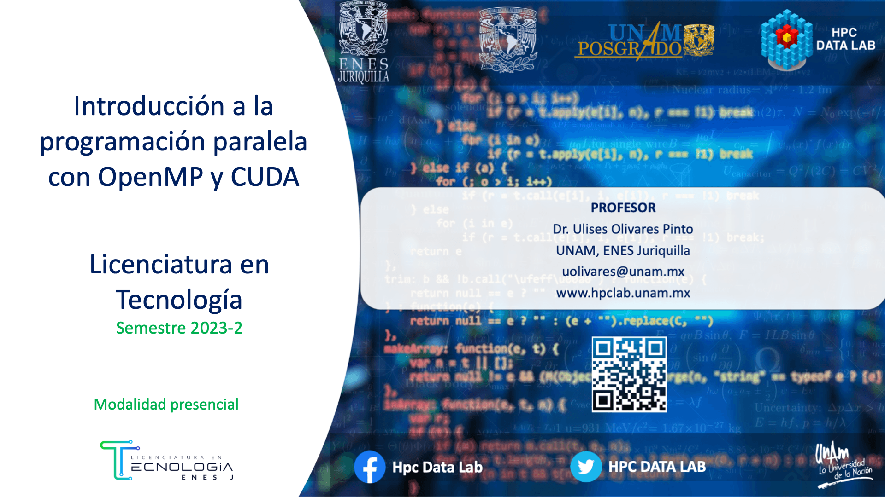

___

# Licenciatura en Tecnología
## Programación Paralela
### Semestre 2023-2

___

## Profesor
 Dr. Ulises Olivares Pinto

## Objetivo del curso
Presentar al estudiante el modelo de programación paralela para CPUs y GPUs para la resolución de problemas inherentemente paralelos.

## Prerequisitos
#### Deseables
+ Dominio de los lenguajes de programación C y C++ 
+ Conicimiento básico de estructuras de datos y algoritmos

#### Hardware
Se deberá contar con una computadora con GPU de la marca NVIDIA

#### Software
Se deberá contar con el siguiente software instalado 

  + OpenMP (https://www.openmp.org/)
  + CUDA Toolkit (https://developer.nvidia.com/cuda-toolkit)
  + Entonrno de desarrollo integrado(IDE)
    - Eclipse
    - Clion
  + [NVIDIA NSIGHT](https://developer.nvidia.com/nsight-visual-studio-edition)
    

#### Cuentas
Se deberán crear cuentas en las siguientes plataformas:
  + Crear una cuenta en GitHub
  
## Contenido del curso
| No.        | Tema           | Conceptos |Código  |  Material complementario|
| :-------------: |:-------------| :-------------|:-----:| :-----|
| 1.              |Introducción a la programación con GPUs          | Introducción a CUDA, modelo de programación paralelo, consulta de dispositivo |   <ul><li>[Hello World](code/1.hello.cu)</li> <li>[vectorAdd](code/2.vectorAdd.cu)</li> <li>[CUDA Samples](https://github.com/NVIDIA/cuda-samples)</li></ul>    |  Capítulo 1 - (D.Kirk et al., 2017)
| 2.              |Organización de bloque e Hilos     | Bloques,  hilos, indexación y rendimiento |   <ul><li>[vectorAdd](code/2.vectorAdd.cu)</li></ul>    |  Capítulos 2 y 3 - (D.Kirk et al., 2017)
| 3.              |Organización de hilos y jerarquía de memoria  | Localidad de datos, memoria compartida, local y global |   <ul><li>[Importar Imágenes](code/importImage)</li></ul>    |  Capítulo 6 - (D.Kirk et al., 2017)
| 4.              |Multiplicación de matrices  | Memoria global |   <ul><li>[Matrix mult. Global](code/3.matrixMultGlobal.cu)</li></ul>    |  Capítulos 4 y 5 - (D.Kirk et al., 2017)
| 5.              |Multiplicación de matrices  | Memoria compartida, tiling |   <ul><li>[Matrix mult Shared](code/4.matrixMultShared.cu)</li></ul>    |  Capítulo 6 - (D.Kirk et al., 2017)
| 6.              |Patrón de acceso paralelo: Convolución  | Memoria compartida, tiling, memoria constante|   <ul><li>[Convolution](code/convolution.cu) </li><li>[Convolution Tiled](code/convolution_tiled.cu) </li></ul>    |  Capítulo 7 - (D.Kirk et al., 2017)
| 7.              |Patrón de acceso paralelo: Suma prefijo  | Memoria compartida, tiling |   <ul><li> </li></ul>    |  Capítulo 8 - (D.Kirk et al., 2017)
| 8.              |Patrón de acceso paralelo: Histogramas  | Operaciones atómicas |   <ul><li>[Histogram](code/histogram.cu)</li></ul>    |  Capítulo 9 - (D.Kirk et al., 2017)

##### Última actualización: 24 de marzo de 2023
